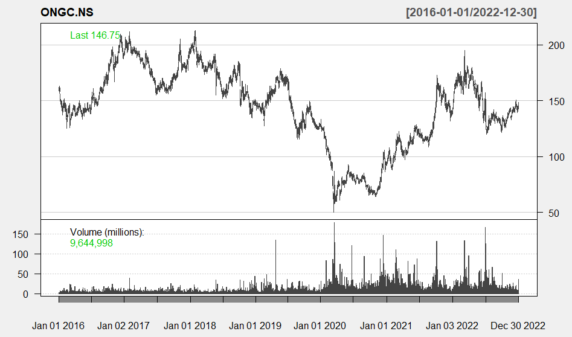

```{r setup, include=FALSE}
knitr::opts_chunk$set(echo = TRUE)
```

# Introduction : 

The commodity market serves as a pivotal hub for various essential goods, and two of the most vital components of this market are crude oil and electricity products. Crude oil, often referred to as the "black gold," holds immense significance in global economies, driving industries, transportation, and overall economic growth. On the other hand, electricity products play an equally crucial role in powering modern societies and propelling industrial activities.

In the context of India, a rapidly emerging economy with burgeoning energy demands, the dynamics of the crude oil and electricity markets assume a critical role. The vastness of India's energy landscape is underlined by its position as one of the world's largest consumers of crude oil and rapidly growing electricity consumption.

# Nature of Commodity :

Crude oil and electricity exhibit distinct natures as commodities. Crude oil, a tangible energy source, is non-renewable, globally traded, and influenced by geopolitical factors. Its price is driven by supply-demand dynamics, production disruptions, and economic conditions. Its storage capacity allows for strategic supply management. On the other hand, electricity is intangible and non-storable, necessitating real-time generation and consumption. Its demand varies by time, weather, and activities. Renewable energy integration adds variability. Regulatory policies and grid stability are paramount. Spot, futures, and options contracts manage electricity risk.

Both commodities play pivotal roles in economies. Crude oil powers industries, transportation, and petrochemicals. Electricity is the lifeblood of modern societies, driving homes, businesses, and technology. The contrasting natures of these commodities shape their markets, impacting trade, investment, and sustainable development.

# Types of Contract :

For each Crude Oil and Electricity, different types of contracts are available.Commodity derivative trading in the Indian markets is relatively new, primarily limited to futures contracts. Notably, only future-type contracts are currently permitted for trading. However, a proposal to expand trading options on these underlyings is in the advanced stages of approval. This signifies a potential evolution in the market's regulatory landscape, paving the way for a broader range of commodity and energy derivatives to be traded, contributing to the maturation and diversification of India's commodity trading ecosystem.

## Crude Oil : 

Crude oil occupies a paramount position as the most actively traded commodity on the Multi Commodity Exchange (MCX), where its daily trading value consistently exceeds Rupees 3000 crores on average. This impressive statistic corresponds to a substantial volume of approximately 8500 barrels of crude oil being exchanged daily. Such a robust market is characterized by enthusiastic participation from both corporate entities and individual retail traders.Remarkably, the MCX serves as a convergence point for a diverse array of market players. Prominent names within the crude oil industry, including upstream and downstream giants such as ONGC, CAIRN, IOC, BPCL, and HPCL, actively partake in trading activities on the MCX platform. These institutional entities skillfully utilize this market to strategically hedge their exposures in the ever-volatile spot market, a prudent move aimed at mitigating risks.

On the flip side, the MCX is equally accessible to retail traders, who predominantly indulge in speculative trading ventures related to crude oil prices. These traders, equipped with insights into market trends and price fluctuations, seek to capitalize on the inherent volatility of crude oil markets, aiming for profitable gains.The MCX, acknowledging the diverse needs of market participants, offers a well-structured range of options for trading crude oil. Among the prominent offerings are two primary crude oil contracts: the main contract and the more compact Crude Oil Mini. This range provides flexibility and tailored solutions to cater to the distinctive preferences and trading strategies of the market's varied stakeholders.

In summation, the MCX stands as a bustling marketplace, with crude oil reigning supreme in terms of trading activity. The participation of corporate heavyweights and nimble retail traders, along with a range of meticulously crafted contracts, collectively contribute to a thriving ecosystem where crude oil's prominence as a tradeable commodity is unequivocal.

## Electricity :

The landscape of electricity has undergone a transformative evolution, marked by significant deregulation and the dissolution of government monopolies. This pivotal shift has been catalyzed by the emergence of electricity derivative markets, which have introduced a new era of dynamism to this critical sector. A notable participant in this transformation is the Chicago Mercantile Exchange (CME) group, which actively engages in trading a future contract intrinsically linked to electricity prices. Moreover, the market has witnessed the flourishing of an Over-the-Counter (OTC) domain, encompassing a spectrum of forward contracts, options, and swaps.Central to this dynamic market are the intricately designed contract structures that facilitate nuanced trading activities. A prime example is the archetypal contract structure where one party acquires a predetermined quantum of megawatt hours at a specified rate for a designated geographical location during a distinct month. This fundamental arrangement forms the bedrock of trading in the electricity market.

Among the array of contracts, the $5\times8$ contracts stand out for their unique provision of power for five days per week, exclusively during peak hours spanning from 11 pm to 7 am. This specialized offering caters to the particular requirements of various stakeholders, aligning with their operational demands.Further enriching the landscape are the $5\times16$ and $7\times24$ contracts, offering comprehensive solutions that accommodate diverse consumption patterns. Option contracts, renowned for their flexibility, furnish traders with the choice of daily or monthly exercise, enhancing strategic opportunities within the market.Adding a layer of intrigue are the Swing Options or Take & Pay Options, a testament to the market's innovation. These options introduce additional complexity and sophistication, broadening the range of opportunities available for market participants.

In essence, the evolution of the electricity market has been characterized by its transition from a regulated monopoly to a vibrant ecosystem of derivative trading. The involvement of key players like CME and the introduction of diverse contract structures, including innovative offerings like Swing Options, highlight the market's adaptability and potential for growth in an ever-changing energy landscape.

# Market Size :

## Crude Oil :

The IEA's India Energy Outlook 2021 reveals an anticipated surge in primary energy demand, with projections indicating a near doubling to 1,123 million tonnes of oil equivalent. This robust growth aligns with India's projected gross domestic product (GDP) expansion to a substantial US$ 8.6 trillion by the year 2040. In the realm of oil refining, India stands strong with an oil refining capacity of 251.2 MMTPA as of April 2022, positioning itself as the second-largest refiner across Asia. The refining landscape reflects private ownership of approximately 35% of the total capacity, signifying a dynamic and diverse market. As a significant player on the global stage, India is poised to contribute significantly to non-OECD petroleum consumption growth.

Within India's energy consumption spectrum, the usage of petrol products in FY23 amounted to a considerable 222.3 MMT. Notably, High-Speed Diesel emerged as the dominant oil product, accounting for 38.6% of the nation's total petroleum product consumption in FY23. The consumption of petroleum products has also seen remarkable growth, standing at nearly 4.44 million barrels per day (BPD) in FY23, a notable increase from 4.05 million BPD in the preceding FY22. Importantly, the energy landscape encompasses liquefied natural gas (LNG), with an import volume of 20.1 million metric tonnes (MMT) during FY23. This aligns with the robust gross production of LNG, reaching 2,883 MMSCM by January 2023, thereby highlighting the significance of natural gas within the energy mix.

Moving forward, the International Energy Agency (IEA) anticipates that India's consumption of natural gas will undergo a substantial expansion, projected to grow by 25 BCM. This growth trend is expected to manifest through an average annual growth rate of 9% until the year 2024. As India strives to balance energy demand with sustainable growth, the nation's energy landscape remains a critical component in global energy dynamics.

To understand the volume/share of ONGC in the market, we have drawn the daily volume/share o ONGC.NS for 2016-01-01 to 2023-01-01.

```{r,fig.align='center',out.width='75%',echo=FALSE}

```

From the above plot, we can see that ONGC shares have shown remarkable growth in the Indian Crude Oil market. The volume and share have steadily increased, driven by rising demand for oil domestically. However, the COVID-19 pandemic had a notable impact. In 2020, the lockdowns and reduced economic activity caused a temporary dip in ONGC's share volume. Nevertheless, the market quickly rebounded in 2021 as economic recovery spurred demand for crude oil. This demonstrates the resilience of the Indian Crude Oil market. The consistent growth trajectory underscores the nation's dependence on ONGC's oil production and its role in the energy sector's stability.

## Electricity :

India boasts its position as the world's third-largest producer and consumer of electricity, exemplifying its significant energy prominence. As of April 30, 2023, the nation's installed power capacity reached an impressive 416.59 GW, underlining its robust energy infrastructure. Of particular note is India's commendable stride in renewable energy, with an installed capacity of 172.54 GW (including hydro), accounting for 41.4% of the overall power capacity. Noteworthy contributions to this renewable capacity include 67.07 GW from solar energy, 42.86 GW from wind power, 10.24 GW from biomass, 4.94 GW from small hydropower, 0.55 GW from waste-to-energy, and 46.85 GW from hydropower sources.

India's continuous commitment to sustainable energy growth is evident in the non-hydro renewable capacity addition, which reached 4.2 GW during the first three months of FY23. This marked a significant advancement from the 2.6 GW recorded during the same period in FY22. FY23 witnessed India's power generation achieve an extraordinary growth rate, increasing by 8.87% to reach an impressive 1,624.15 billion kilowatt-hours (kWh). Complementing this, power consumption, as documented by the Ministry of Power, stood at 130.57 BU in April 2023.

Furthermore, India's energy landscape highlights the peak power demand of 226.87 GW during April 2023, demonstrating the nation's energy hunger. Within this framework, coal plants displayed a commendable performance, achieving a plant load factor (PLF) of 73.7% in the first nine months of FY23—a remarkable improvement from the 68.5% recorded in FY22. As the nation continues its trajectory toward enhanced energy efficiency, the thermal power plant load is projected to improve by 63% in FY24. This trajectory is buoyed by robust demand growth, combined with restrained capacity addition in the sector, collectively symbolizing India's ongoing commitment to a sustainable and dynamic energy future.

To understand the volume/share of IEX in the market, we have drawn the daily volume/share o IEX.NS for 2016-01-01 to 2023-01-01.

```{r,out.width='75%',fig.align='center',echo=FALSE}
knitr::include_graphics('IEX.png')
```

From the above plot,we can see that the Indian Energy Exchange (IEX) has exhibited robust performance in the electricity trading market. The volume and share of IEX have consistently grown, reflecting a positive trend in India's power sector. Despite the disruptions caused by the COVID-19 pandemic in 2020, IEX demonstrated resilience. During the lockdowns, the trading volume briefly dipped, but it rebounded in 2021 as economic activities resumed. This indicates the essential role played by IEX in maintaining the stability of India's electricity market. The steady growth over the years underscores the significance of IEX as a key player in facilitating efficient electricity trading and meeting the nation's energy needs.However for last 1-2 years we can see a decreasing trend. 


# Contract Price Modelling Approaches :

Contract modelling approaches for commodity prices are pivotal in the commodity market's intricate ecosystem. These approaches aim to decipher and predict price dynamics, enabling informed decision-making for traders and stakeholders. By employing various techniques such as statistical models, time series analysis, and derivatives pricing methods, these approaches provide a lens into the behavior of commodity prices within the market's ever-evolving landscape. Through insightful modelling, market participants gain valuable insights into price movements, aiding risk mitigation and strategic planning.

## Mean-Reverting Process : 

To value derivatives, we are often interested in modeling the spot price of a commodity in the traditional risk neutral world. Under this risk neutral world the commodity price $S$ follows the following equation for Mean-Reversion process.   

$$d\ln(S)=[\theta(t) - a\ln(S)]dt + \sigma\ dz$$
Where, $\{Z_t\}_{t > 0}$ is Wiener process. 

Most of the pricing models assume mean reverting processes.There are intuitive reasons for this. As the price of a source of energy rises, it is likely to be consumed less and produced more. This creates a downward pressure on process. As the price of a source of energy declines, it is likely to be consumed more, but production is likely to be less economically viable. This creates upward pressure on the price. To construct an approximate solution trinomial tree can be used. It is used to determine the value of $\theta(t)$ under some constraints. 

```{r,out.width='75%',fig.align='center',echo=FALSE}
knitr::include_graphics("C:/Users/User/Pictures/Screenshots/mrpro.png")
```

## Jump Models : 

Commodities like Electricity, Natural gas exhibit price jumps because pf weather related demand shocks. This is true for agricultural products as well. Jumps can be incorporated in the equation of mean reverting process by the following modification.


$$d\ln(S)=[\theta(t) - a\ln(S)]dt + \sigma\ dz + dp$$
Where, $dp$ is the Poisson Process generating the percentage jumps. This is similar to Merton's mixed jump-diffusion model for stock prices. Once the jump frequency and jump size probability distribution have been chosen, the average increase in the commodity price at a future time $t$ that is as a result of jumps can be calculated. To determine $\theta(t)$, the trinomial tree method can be used with the futures prices for maturity $t$ reduced by this increase.

```{r,out.width='75%',fig.align='center',echo=FALSE}
knitr::include_graphics("C:/Users/User/Pictures/Screenshots/jump.png")
```

## Other Models :

More sophisticated models are sometimes used for oil prices. If $y$ is the convenience yield, then the proportional drift of the spot price is $r - y$,where $r$ is the short-term risk-free rate and a natural process ti assume for the spot price is - 

$$\frac{dS}{S} = (r-y)dt + \sigma_1\ dz_1$$
Gibson and Schwartz suggest that the convenience yield $y$ be modeled as a mean reverting process.

$$dy = k(\alpha - y)dt  + \sigma_2 \ dz_2$$
Where $k$ and $\alpha$ are constants and $dz_2$ is a Weiner process, which is correlated with the Weiner process $dz_1$. To provide an exact fit to futures prices, $\alpha$ cab be made a function of time. 
Eyedeland and Geman propose a stochastic volatility for electricity prices. Which is - 

$$\frac{dS}{S} = a(b - ln(S))dt + \sqrt{V}dz_1$$
$$dV = c(d - V)dt +  e\sqrt{V}dz_2$$
Where $a,b,c,d$ and $e$ are constants and $dz_1$ and $dz_2$ are correlated Weiner processes. Later German proposed a model for oil where the reversion level $b$ is also stochastic.

# Conclusion :

In conclusion, the commodities market, notably crude oil and electricity, operates within a dynamic ecosystem heavily influenced by economic, geopolitical, and technological forces. Crude oil, often dubbed "black gold," fuels industries and economies globally, while electricity is the lifeblood of modern societies. In the Indian context, both commodities play pivotal roles as the nation's energy demands escalate.

India's energy landscape is poised for significant growth, with primary energy demand projected to double, and GDP expansion forecasted. The crude oil sector, with its refining capacity and consumption patterns, positions India as a notable player in global consumption. Electricity's role is equally potent, reflected in India's status as a major producer and consumer worldwide. The modeling of contract prices for these commodities is paramount in understanding their price dynamics. Techniques like mean-reverting processes and incorporating jumps provide tools to navigate the complexities of these markets. These models enable stakeholders to make informed decisions amid market volatility.

Overall, the report underscores the significance of crude oil and electricity in shaping global economies and India's energy landscape. As these commodities continue to play essential roles in energy sustainability and economic progress, their market dynamics and pricing models offer insights into the intricate interplay between economic forces and energy demands.


# References :

* [Jump-Diffusion Process with Drift and Mean-Reversion](https://medium.com/@polanitzer/jump-diffusion-process-with-drift-and-mean-reversion-in-python-simulate-the-future-distribution-of-8e62c847abef)

* [Indian Energy Exchange Limited | IEX India](https://www.iexindia.com/)

* [Electricity Derivatives And Term Ahead Contracts In The Power Sector](https://www.mondaq.com/india/commoditiesderivativesstock-exchanges/1138612/introducing-electricity-derivatives-and-term-ahead-contracts-in-the-power-sector)

* [Crude Oil Economy News](https://tradingeconomics.com/commodity/crude-oil)

* [John C. Hull | Options, Futures, and Other Derivatives](https://www.amazon.in/Options-Future-Other-Derivatives-John/dp/9352866592)

* [quantmod: Quantitative Financial Modelling Framework in R](https://cran.r-project.org/web/packages/quantmod/quantmod.pdf)


